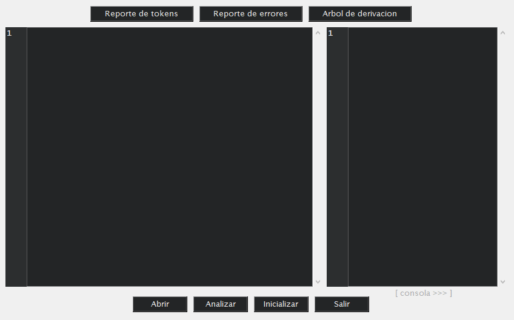
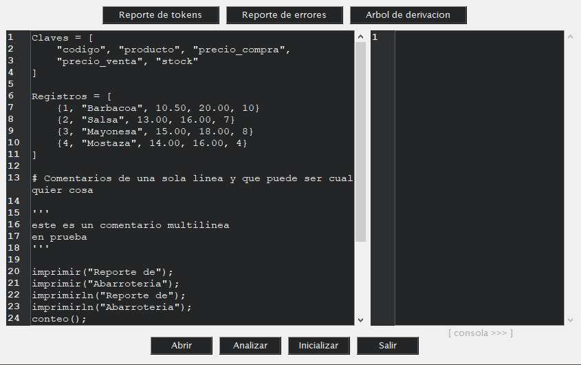
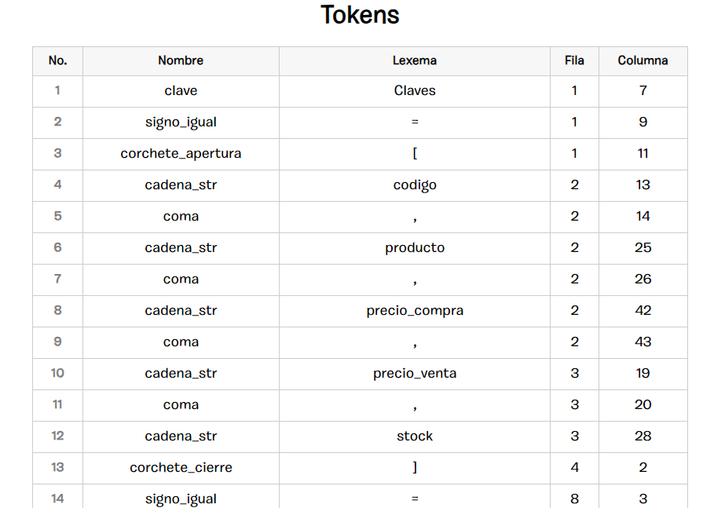
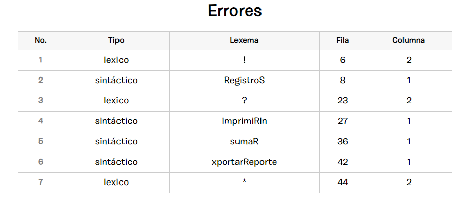

UNIVERSIDAD DE SAN CARLOS DE GUATEMALA

LENGUAJES FORMALES Y DE PROGRAMACIÓN

SECCIÓN A-

# 
 MANUAL DE USUARIO 

Nombre: Jennifer Yulissa Lourdes Taperio Manuel

Carné: 202103763

Ciudad de Guatemala, 28 de octubre de 2023

___

### OBJETIVOS
* Brindar una aplicación que analiza archivos con extensiones .json del
cual se puede hacer un análisis léxico y generar un reporte.
* Conocer más acerca de los autómatas y gramáticas libres de contexto.

### REQUISITOS DEL SISTEMA
* Windows 10,8,7 (x86 y x64)
* Procesador a 1.6 GHz o superior
* 1 GB (32 bits) o 2 GB (64 bits) de RAM (agregue 512 MB al host si se ejecuta en una máquina virtual)
    * 3 GB de espacio disponible en el disco duro
* Disco duro de 5400 RPM
* Tarjeta de vídeo compatible con DirectX 9 con resolución de pantalla de 1024 x 768 o más

#### DESCARGAR VISUAL STUDIO CODE
Link de descarga [Visual Studio Code](https://code.visualstudio.com/download "vscode")

#### DESCARGAR PYTHON
Link de descarga [Python](https://www.python.org/downloads/ "python") ver manual de instalación en la página Oficial

___

### MENU PRINCIPAL

Se puede visualizar el menu principal con el que interactuará el ususario en primera instancia.
### CONTENIDO

### ARCHIVO TOKENS DE SALIDA (html)

### ARCHIVO ERRORES DE SALIDA (html)

